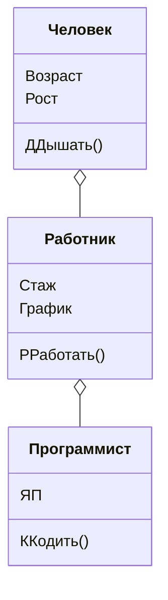

# Отношения между типами
В этой лабе используются *наследование*, *абстрактные классы*, *интерфейсы* и уже изученные обычные классы.   
***Задача:*** написать код для игр "Балда" и "Крестики-нолики" с использованием разных типов.

## Наследование
***Наследование*** позволяет создавать классы, которые расширяют функциональность или изменяют поведение уже существующих классов. В отношении наследования выделяются два ключевых компонента. Прежде всего это **базовый класс** (класс-родитель, родительский класс, суперкласс), который определяет базовую функциональность. И **производный класс** (класс-наследник, подкласс), который наследует функциональность базового класса и может расширять или модифицировать ее.      

Чтобы функциональность класса можно было унаследовать, необходимо определить для этого класса аннотацию `open`. По-умолчанию без этой аннотации класс не может быть унаследован.      
Общий вид:    
```Kotlin
open class класс_родитель
class класс_наследник: класс_родитель
```

Например: создадим объект класса "работник", который наследует класс "человек". Данный объект будет иметь не только свойства и методы для работника, но и для человека.
```Kotlin
fun main() {
    val bob: Employee = Employee()
    bob.name = "Bob"
    bob.printName() // вызов функции класса_родителя
}
open class Person{
    var name: String = "Undefined"
    fun printName(){
        println(name)
    }
}
class Employee: Person()
```
> Замечание: если классу нужно передавать аргументы, то при наследовании их необходимо передать!        
> Пример:
```Kotlin
open class Person(val name: String){
    fun printName(){
        println(name)
    }
}
class Employee(empName: String): Person(empName)
```

На диаграмме видно, что объект класса Работник может использовать как свои свойства/методы, так и свойства/методы класса Человек. Любок Работник имеет качества, принаджежащие Человеку, но Человек сам по себе не имеет качества Рабитника. Также класс Работник не может пользоваться свойствами/методами класса Программист. 
Объект класса Программист может пользоваться свойствами/методами класса Работник и Человек, так как Программисту присущи качества и Работника и Человека.     
        
Свойство/метод из класса_родителя можно переопределить с помощью ключевого слова `override`. Например:
```Kotlin
fun main() {
    val anna: Employee = Employee("Анна")
    print(anna.fulname) // Самый лучший работник: Анна
}
open class Person{
    var name: String = "ИМЯ"
    var fulname: String = "ПОЛНОЕ ИМЯ"
}
class Employee(var name: String): Person(){
    override var fulname: String = "Самый лучший работник: " + name
}
```

## Абстрактные классы и методы
***Абстрактные классы*** - это классы, определенные с модификатором **abstract**.       
***Абстрактный класс*** - это класс, представляющий из себя “заготовку” для целого семейства классов, который описывает для них общий шаблон поведения. Отличительной особенностью абстрактных классов является то, что мы **не** можем создать объект подобного класса.

Он представляет собой характеристики, которые относятся к отпередленной группе, но не имеют четкой формы. Например, квадрат и круг - это фигуры, но фигуры так таковой не существует, у них из общего есть периметр и площадь, которые являются абстрактными. То есть периметр и площадь имеют все фигуры вне зависимости какой они формы.
```Kotlin
// абстрактный класс фигуры
abstract class Figure {
    // абстрактный метод для получения периметра
    abstract fun perimeter(): Float
 
    // абстрактный метод для получения площади
    abstract fun area(): Float
}
// производный класс прямоугольника
class Rectangle(val width: Float, val height: Float) : Figure()
{
    // переопределение получения периметра
    override fun perimeter(): Float{
        return width * 2 + height * 2
    }
    // переопрелеление получения площади
    override fun area(): Float{
        return width * height
    }
}
```
Или, например, **абсолютно все** транспортные средства, будь то автобус, самолет или лодка, они все могут перемещаться. Это будет абстрактным методом, так как это свойственно всей группе вне зависимости от их типа.
```Kotlin
// абстрактный класс транспорта
abstract class Transport {
    // абстрактные методы перемещения
    abstract fun move() // движение
    abstract fun stop() // остановка
}
// производный класс транспорта
class Car() : Transport()
{
    // переопределение для движения
    override fun move(){
        print("Ехать!\n")
    }
    // переопрелеление для остановки
    override fun stop(){
        print("Тормозить!\n")
    }
}
```
Абстрактные классы могут иметь конструктор, а так же они могут использоваться для наследования.  
### Наследование

Все свойства и методы, отмеченные словом **abstract**, нужно переопределить с помощью `override`. Если они были опредленны по-умолчанию, то это можно не делать.


## Интерфейсы
***Интерфейсы*** представляют контракт, который должен реализовать класс. Интерфейсы могут содержать объявления свойств и функций, а также их реализацию по умолчанию.

***Интерфейс*** - это совокупность методов и правил, которые определяют ***поведение*** класса или ***общее поведение*** для группы независимых друг от друга классов. Интерфейсы похожи на абстрактные классы тем, что нельзя создать их экземпляры и они могут определять абстрактные или конкретные функции и свойства. Отличие в том, что интерфейсу не важна связь “родитель-наследник”, он задаёт лишь правила поведения.


###### Ожидается обновление... 

Для лучшего ознакомления с темой рекомендую посетить сайты [metanit.com](https://metanit.com/kotlin/tutorial/), [bimlibik](https://bimlibik.github.io/posts/kotlin-abstract-classes-and-interfaces/)
